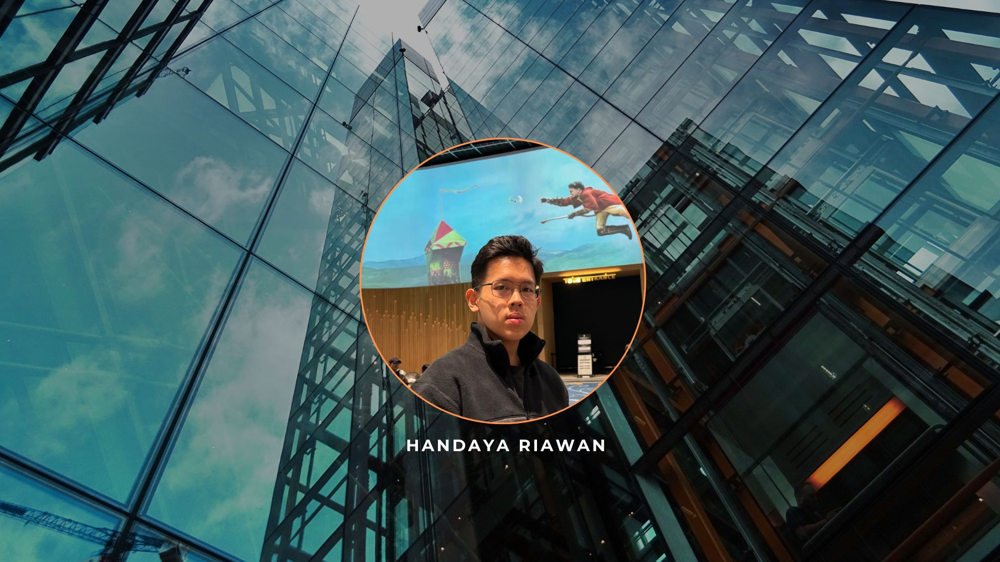

### Hi there, I'm Handaya 👋

<!--
**GoldTeaaa/GoldTeaaa** is a ✨ _special_ ✨ repository because its `README.md` (this file) appears on your GitHub profile.
-->

I'm a passionate developer building a lightweight ERP web application to streamline operations for Mulyadi Riawan & Partners Insurance Agency. I enjoy creating efficient solutions for handling reports, policy settlements, and customer management.

---

### 🚀 What I'm Up To

- 🔭 I’m currently building with **Next.js, React, and Supabase**.
- 🌱 I’m focused on deepening my knowledge in full-stack web development and blockchain technology.
- 📫 How to reach me: **handayariawan@gmail.com** | **handaya.riawan@binus.ac.id**
- � Pronouns: He/Him

---

### 💻 My Tech Stack

  
  
  
  
  
  
  

---

### 📊 My GitHub Stats

  
  

<i>These stats are just a snapshot of my ongoing journey. I'm always learning and striving to improve more!</i>

---

### 🤝 Connect with Me

 